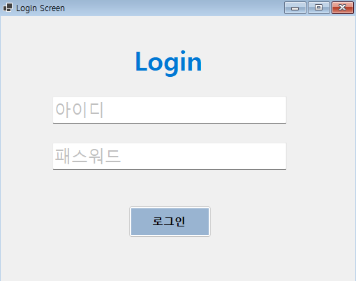
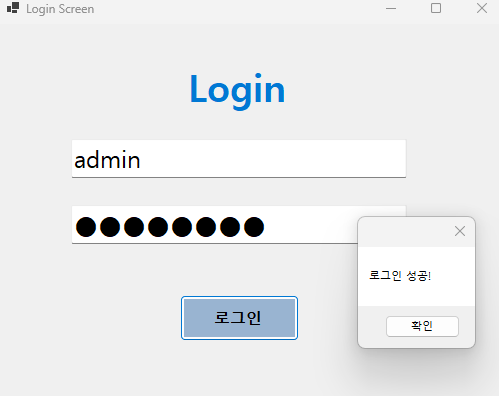
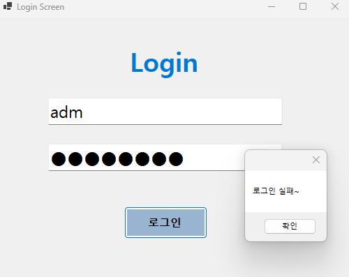

## 개요

- C# 프로그래밍 학습

- 1줄 소개: 사용자의 아이디와 패스워드를 입력받는 로그인 화면

- 사용한 플랫폼:
    - C#, .NET Windows Forms, Visual Studio, GitHub
- 사용한 컨트롤:
    - Label, TextBox, Button

- 사용한 기술과 구현한 기능:
    - Visual Studio을 이용하여 로그인 화면 UI 구성
    - 패스워드 입력 내용을 숨기는 기능 구현
    - tab을 이용한 입력 포커스 순서 제어
    - placeholder 기능 구현

## 실행 화면 (과제1)
- 과제1 코드의 실행 스크린샷

- 과제 내용
    -  기본 UI 구성하기
    - PasswordChar 속성을 이용하여 패스워드 입력 내용을 숨기는 기능 구현하기
    - 로그인 가능 여부 체크 기능 구현하기
    - 로그인 성공/실패 메시지박스 출력하기

- 구현 내용과 기능 설명
    - 아이디와 패스워드 입력칸을 회색으로 표시한다.
    - 맞는 아이디를 입력하였을때 로그인 성공 메시지 박스가 출력된다.
    - 패스워드를 입력하면 보안을 위한 입력 내용 숨김 기능이 작동한다.

- 사용한 기술과 구현한 기능:
    - TextBox, Label, Button 같은 컨트롤을 이용하여 Ui 구성
    - passwordChar 속성을 이용하여 패스워드 입력 내용을 숨기는 기능 구현
    - if문을 이용하여 로그인 가능 여부 체크 기능 구현
    - == 연산자를 이용하여 아이디와 패스워드 일치 여부 체크
